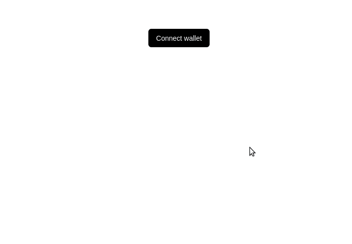

# Algorand Wallet Select



A single Web3 / Algorand provider solution for all Wallets.

## Introduction

AlgorandWalletSelect is an easy-to-use library to help developers add support for multiple providers in their apps with a simple customizable configuration.

By default AlgorandWalletSelect Library supports injected providers like (AlgoSigner, MyAlgoWallet, etc) and WalletConnect (OfficialAlgorandWallet, etc). You can also easily configure the library to support more wallets.

## Projects using AlgorandWalletSelect

Open a PR to add your project to the list!

- [xBacked DAO](https://xbacked.io/)

## Usage

1. Install the AlgorandWalletSelect NPM package

```bash
npm install --save @xbacked-dao/algorand-wallet-select
# OR
yarn add @xbacked-dao/algorand-wallet-select
```

2. Add algorand-wallet-select to your Dapp as follows

```javascript
import { WalletSelector } from "algorand-wallet-select";

const returnWallet = async (data) => {
  if (!!data) {
    console.log(data.connector.check());
    console.log(await data.connector.connect());
    console.log(data.connector.provider);
  }
};

const Template = (args) => (
  <div>
    <h1 className="ws-text-lg">Algorand Wallet Selector</h1>
    <p>Built with 💚 by xBacked</p>
    <WalletSelector returnWallet={returnWallet} />
  </div>
);
```

## Optional: Configuring wallets to display

Simply do the following to only display the MyAlgo wallet. Valid `wallets` are `myalgowallet`, `algosigner` and `walletconnect`.
```javascript
const Template = (args) => (
  <div>
    <h1 className="ws-text-lg">Algorand Wallet Selector</h1>
    <p>Built with 💚 by xBacked</p>
    <WalletSelector
      returnWallet={returnWallet}
      wallets=["myalgowallet"]
    />
  </div>
);
```

## Adding a new provider

Do you want to add your provider to Web3Modal?

Note: This flow will be simplified in future updates. 

All logic for supported providers lives inside `src/wallets/providers`.

1. You must add a new connection definition to `src/wallets/providers` that matches the following signature (using MyAlgo as an example):
```javascript
// Import the package.
import MyAlgo from '@randlabs/myalgo-connect';

// Default export defining the instance and the standard interface.
const ConnectToMyAlgo = () => {
  // Construct any required state for the connector.
  const myAlgoWallet = new MyAlgo();

  // Must return the following object.
  return {
    // Instance defined above.
    provider: myAlgoWallet,
    // Asynchronous function wrapping the connection method for the provider.
    connect: async () => await myAlgoWallet.connect(),
    // An optional function to check connection status if possible.
    check: () => (false),
  };
}

export default ConnectToMyAlgo;
```
2. Add new connector to the default export in `src/wallets/providers`:
```javascript
import algosigner from "./algosigner";
import myalgowallet from "./myalgowallet";
import walletconnect from "./walletconnect";
// Import here and export below.
import myNewWallet from "./myNewWallet";

export {
  algosigner,
  myalgowallet,
  walletconnect,
  myNewWallet,
};
```

3. Add a `.png` or `.svg` as a logo for the added wallet connector to `src/wallets/logos`

4. Depending on the type of connector, create an entry in either the `src/wallets/injected.js` file or the `src/wallets/providers.js` file.

5. After testing that the logo is displaying correctly, and you are able to return the valid instance create a pull request to this repository!
## License

MIT
